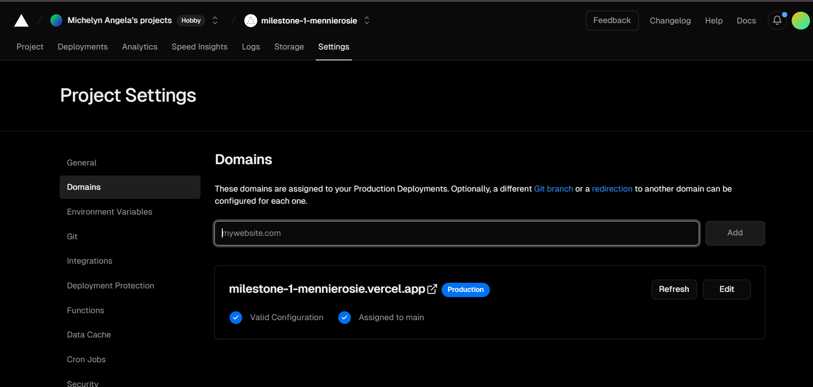
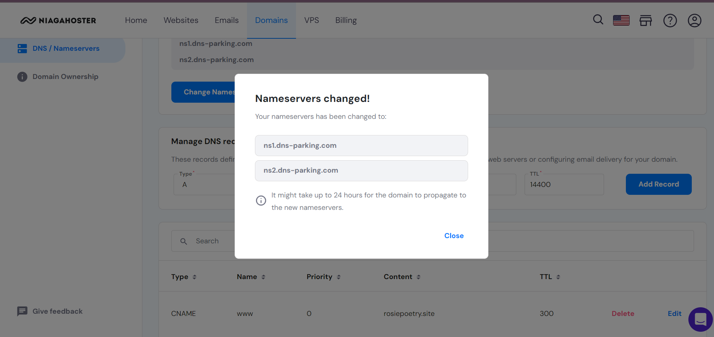

# YAREX

This is a company website, which is engaged in the provision of technology services

## Our Best Services

- Web Development
- App Development
- Digital Strategy
- UI/UX Design

## Our Features

### 1. Navbar

It helps users easily navigate through the website. It typically includes links to the main sections of the site.

### 2. Contact Form

Enables users to leave messages or feedback through a simple form, facilitating communication with our company.

### 3. Responsive Design

Ensures that our website is accessible and visually appealing across various devices, including desktops, tablets, and smartphones.

## Creator

A website by Michelyn Angela Sabatini Rajagukguk

## Visit my website here!

### My website: https://rosiepoetry.site/

### Vercel link: https://milestone-1-mennierosie-git-main-michelyn-angelas-projects.vercel.app/

# Development Stages

## Day 1 - Build the HTML

Building the HTML structure using semantics.

### HTML Head

In the HTML head, contains a rel link that will connect the HTML with the stylesheet.

### Navigation Bar

In the navigation bar, I used semantic tags nav and used ul, li lists for ordered information.

### Html Header

In Header, I use heading tags (h1) and paragraph tags (p)

### Section About

In About section, I use semantic tags (article) that I make into section grids.

### Section Services

Services section is used to describe our services that use ul, li lists for the content.

### Section Growth

The Growth section consists a responsive image of our business growth charts

### Section Contact

The Contact section comprises a form with individual field labels, including a text area where users can input their message to Yarex Company.

### Footer

The Footer contains a short description of the author's name.

## Day 2 - Decorate using CSS and build Responsive web design

### Hamburger Button

The navigation bar features a hamburger icon that serves as an alternative to desktop navigation on mobile devices. I have also employed a JavaScript script to unfold the navigation stack upon clicking the hamburger icon.

### CSS Grid

CSS Grid is used to design the About section.

### Responsive layout for tablet

I designed a responsive layout for tablets to ensure that a website adapts its design seamlessly to suit tablet screen sizes effectively.

### Responsive layout for mobile

I designed a responsive layout for mobile to ensure that a website seamlessly adjusts its design to suit mobile screen sizes effectively.

## Day 3 - Deployment on Vercel

1. Go to https://vercel.com/

2. Click **_Log in_** on Vercel
   

3. Select **_Continue with Github_**
   

4. On your homepage on Vercel, click on **_Add New..._**
   

5. Select **_Project_** as your deployment option
   

6. Select **_Import Git Repository_** to correct the Repository on your Github account. Make sure that you are in the correct organization

7. Click **_Search_**, then fill in your branch name to make it easier to find. After that select **_Import_**
   

8. Follow the steps to configure your Project
   

9. Click on **_Deploy_** button to start the deployment process
   

10. Scroll down to see the deployment process time. You can select Cancel Deployment if you want to stop the process.
    

11. Congratulations, your deployment has been successfully connected from Github.
    

12. Follow the link on the Domains to see your site!

## Day - 4 Connect to domain and DNS on Vercel

1. Go to Vercel, then login

2. On your homepage, go to **_Project_** and select the project that you want to create a custom domain for.
   

3. Click on **_Domains_**
   

4. Enter your domain name that you already have
   

5. then click **_Add_**
   

6. You will be redirected to your _Domains_ page, then click on **_or Nameservers_**
   

7. Copy your **_Intended Nameservers_** and save it to the clipboard to keep them to be used later
   

8. Go to your **_Domain Register_**, login, go to Custom Domains then click on **_Manage_**
   

9. Scroll down to Domain Information, click on **_Change_** then paste all the copied nameservers into the 4 field
   

10. It will take 24 hours for the Nameservers changes to connect and configure with your domain and DNS.
    

11. After 24 hours, you can check again on your own **Site** and **Vercel** link that your domain has been successfully configured.
    
